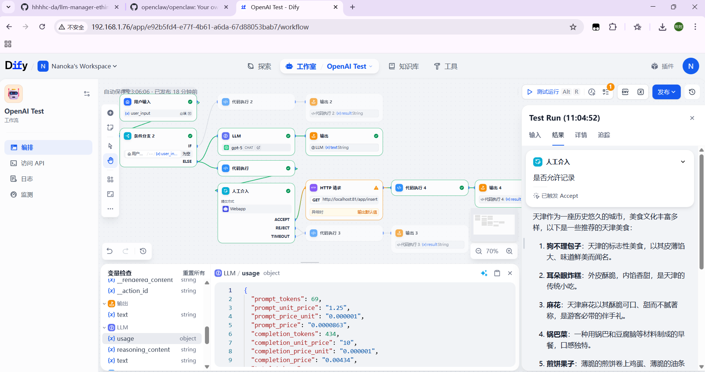
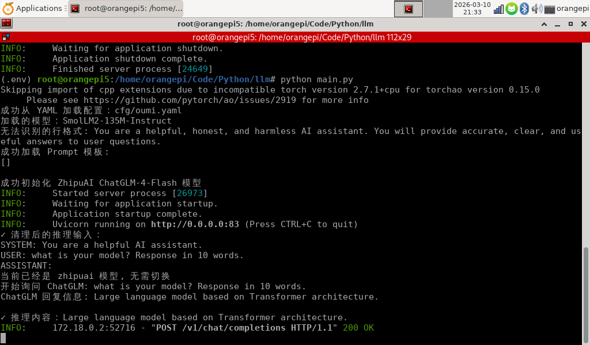
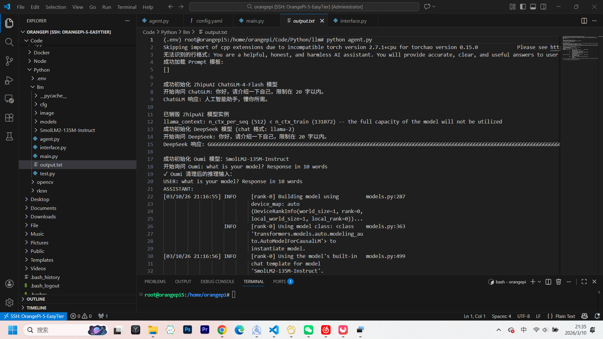
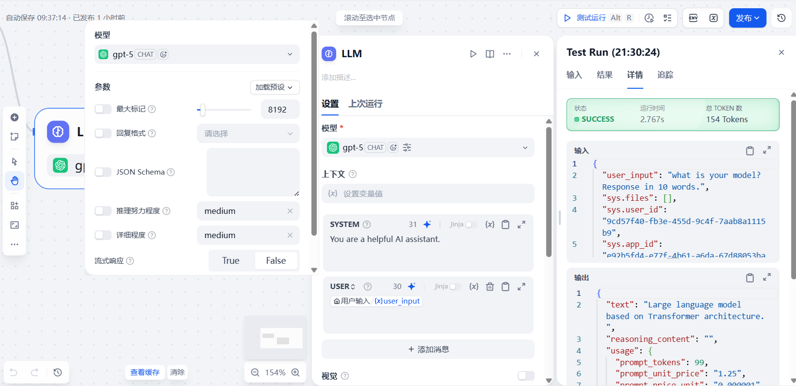

# LLM 管理插件

本插件用于将模型导出成 OpenAI 接口，可以由 `http://localhost:83/v1/chat/completions` 直接访问接口，同时已经使用 `Dify` 进行验证

最后呈现出的结果是这样的，右侧 `text` 就是我们模型的输出 (由 ChatGLM-4-Flash 推理)



### 支持的模型

目前支持三种模型, 分别使用 `oumi`、`zhipuai`、`llama.cpp` 进行操作

|模型|框架|下载地址|
|----|----|----|
|SmolLM2-135M-Instruct|oumi|https://hf-mirror.com/HuggingFaceTB/SmolLM2-135M-Instruct|
|ChatGLM-4-Flash|zhipuai|访问 https://open.bigmodel.cn/ 申请|
|DeepSeek-R1-Distill-Qwen-1.5B-Q8_0.gguf|llama.cpp|https://hf-mirror.com/roleplaiapp/DeepSeek-R1-Distill-Qwen-1.5B-Q8_0-GGUF|

这三个模型封装在 `LargeLanguageModelManager` 中，仅在 `change_llm_model` 后对模型进行初始化，初始化后将持续到下一次修改模型

**p.s. llama.cpp 对 debian 12 arm64 的支持不太完善，如果线程开太多容易直接 reboot**

当前项目使用 `llama.cpp` 用 **2 线程** 进行推理, `oumi` 自动控制推理进程，基本是满的

### 使用 OpenAI 接口

修改 `config.yaml` 中的配置

```yaml
llm:
  llm-server: remote # 可选项: local, remote
  chatglm-api: 123456 # 填写成自己的 API 即可
  prompt: /home/orangepi/Code/Python/llm/cfg/prompt.txt
  llama-path: /home/orangepi/Code/Python/llm/DeepSeek-R1-Distill-Qwen-1.5B-Q8_0.gguf
```

需要将后三个进行修改，写成自己的路径 (介于 `oumi` 仅支持 `Linux` 所以就仿照我的写法)

```bash
# 配置编译参数（需要编译 llama.cpp）
export CC=gcc
export CXX=g++

# 有一个 zhipuai 的依赖我忘了是啥了，自己安装一下啊
pip install oumi uvicorn fastapi pyyaml zhipuai llama-cpp-python

# 开始 HTTP 阻塞后端进程
python main.py
```

之后就可以得到我们的后端信息，经过推理之后大约是这样的输出



这样我们就是成功推理了，不放心的话也可以使用 `python agent.py` 进行测试，输出大概像下面这样



### 修改我们的推理模型

由于我们没有在前台配置切换模型，也许你可以用不同版本的 `gpt` 进行切换，但我还是愿意在后端改，**主要是因为修改需求不大**

我们在这里进行修改

```python
@app.post("/v1/chat/completions", dependencies=[Depends(get_api_key)])
def chat_completions_openai(request: ChatCompletionRequest) -> ChatCompletionResponse:
    yaml_model = BASE_CONFIG.model.model_name

    # 省略一大堆没用的代码...

    try:
        user_question = ""
        for msg in reversed(request.messages):
            if msg.role.lower() == "user":
                user_question = msg.content
                break
        if not user_question:
            raise ValueError("未找到用户消息")
        
        model_switch_map = {
            "gpt-5": "zhipuai", # 我在 Dify 内配置的 gpt-5 接口, 修改这个即可 👈
            "zhipuai-chatglm-4-flash": "zhipuai",
            BASE_CONFIG.model.model_name: "oumi",
            "deepseek-r1": "deepseek-r1"
        }

        # 如果请求的模型不在映射中，默认使用 oumi
        target_model = model_switch_map.get(request.model, "oumi")
        llm_manager.change_llm_model(target_model)
```

### 在 Dify 中进行的部署

由于我们是导出的 `OpenAI` 的接口，所以我们也要对接 `OpenAI` 的模型，就像这样



**流式访问接口必须关闭，否则不会正确解析出结果**

之后就可以随意的接到其他的内容中了，只要符合 `Dify` 自身的格式即可
